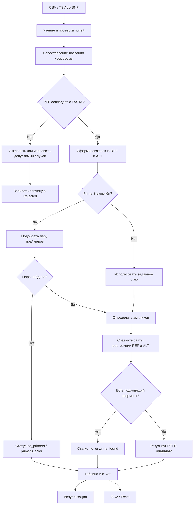

# RFLP Picker

RFLP Picker — настольная программа для поиска рестриктаз, которые различают
аллели SNP, и подбора PCR-праймеров через Primer3. Программа сравнивает REF и
ALT на референсном FASTA, показывает размеры фрагментов и позволяет открыть
схему ампликона.

## Суть программы

RFLP Picker получает список SNP, проверяет их по референсному геному и ищет
рестриктазы, которые дают различимый рисунок фрагментов для аллелей REF и ALT.
Если включён Primer3, для подходящего участка дополнительно подбирается пара
PCR-праймеров. В результате для каждой позиции видны фермент, сайт узнавания,
размеры фрагментов, параметры праймеров и понятный статус обработки.

Схема обработки одной позиции:



Нормализация нужна для того, чтобы не анализировать ошибочные координаты и
аллели. Она не заменяет проверку: даже при отключённой нормализации программа
всё равно контролирует наличие хромосомы, диапазон координат и соответствие
REF референсу.

## Запуск из исходников

Требуется Python 3.11 или новее. В PowerShell из этой папки выполните:

```powershell
python -m pip install -r requirements.txt
```

Затем запустите приложение:

```powershell
python qtprimer3_vis.py
```

Оформление автоматически подстраивается под тему Windows 11. Переключение
светлой и тёмной темы во время работы также обновляет цвета интерфейса.

## Запуск готовой версии Windows

Скачайте архив релиза и запустите `RFLP-Picker.exe`. Python на
компьютере для этого не требуется. Референсный FASTA не входит в архив из-за
размера; укажите его полный путь в поле FASTA. Папка `names/` в архиве содержит
готовое соответствие названий хромосом для используемого генома.

Готовый архив релиза находится в разделе Releases на GitHub. Для пересборки EXE
из исходников требуется Python 3.13 и зависимости из `requirements.txt`;
выполните `.\build_windows.ps1`. Результат появится в `dist/RFLP-Picker/`.

Архив распространяется без README: инструкция находится в этом файле на
GitHub, а рядом с EXE должны находиться папка `_internal` и каталог `names`.

## Данные

В окне выберите:

- файл вариантов CSV, TSV или TXT с колонками `chrom`, `pos`, `ref`, `alt`;
- референсный геном FASTA из `genoms/`;
- необязательный файл соответствий названий хромосом из `names/`.

Поля FASTA и соответствий редактируемые: можно указать полный путь к файлам,
которые хранятся вне репозитория.

Поддерживаются одиночные SNP: один символ в `REF` и один символ в `ALT`,
только `A`, `C`, `G`, `T`. Позиции в файле начинаются с 1. CSV с кавычками и
UTF-8 с BOM поддерживается. Некорректные строки сохраняются в
`results/normalize/*.rejected.tsv`, если включено сохранение нормализации, с
номером исходной строки и причиной; в любом случае причины видны в журнале.

Для проверки используйте собственный небольшой CSV/TSV-файл с вариантами.

## Параметры

Фланк задаёт число оснований по обе стороны SNP. Размер фрагмента и порог Δ
ограничивают пригодность электрофоретических полос. Δ — минимальное
симметричное расстояние между размером полосы одного аллеля и ближайшим
размером полосы другого аллеля; он применяется и к gain/loss, и к shift.

При включённом Primer3 программа ищет пару праймеров в заданном диапазоне
размера продукта и Tm. Если пара не найдена, строка получает статус
«Праймеры не найдены» и не выдаёт ложные ферментные кандидаты. Если Primer3
выключен, поиск идёт по полному окну и помечается «Поиск по окну».

Проверка координат и соответствия `REF` FASTA обязательна всегда. Опция
пропуска нормализации отключает только автоматическую перестановку REF/ALT.

## Результаты и экспорт

В таблице можно сортировать и фильтровать результаты по ферменту и паттерну.
Выберите строку, чтобы увидеть технические подробности и открыть визуализацию.
Кнопка экспорта CSV сохраняет UTF-8 с BOM. Экспорт Excel создаёт листы
`Results`, `Run` и `Rejected`, сохраняет параметры запуска и типы
числовых значений. Результаты по умолчанию записываются в `results/`.

## Структура проекта

`qtprimer3_vis.py` — графический интерфейс; `rflp_core.py` — чтение,
нормализация и расчёт; `reporting.py` — безопасный CSV/XLSX экспорт;
`result_model.py` — типизированная модель для дальнейшего расширения таблицы;
`resources_rc.py` — ресурсы Qt; `genoms/` и `names/` — исходные данные.

## Проверка

Запуск тестов:

```powershell
python -m unittest discover -s tests -v
python -m py_compile qtprimer3_vis.py rflp_core.py reporting.py result_model.py
```
